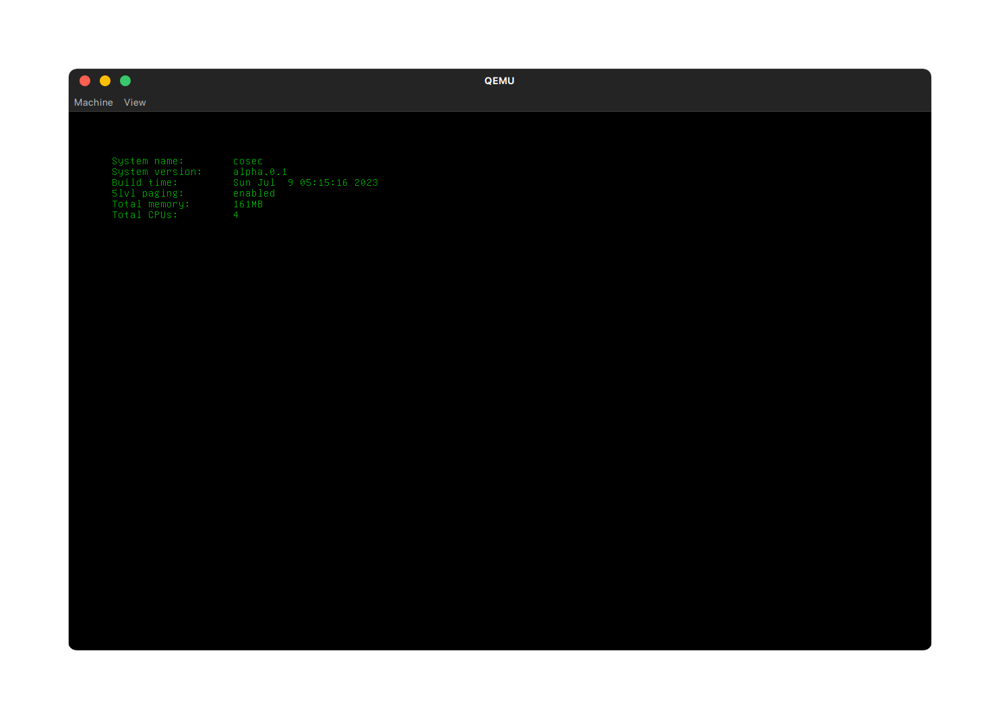
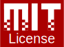

# COSEC

## About
A hobby OS with minimal functionality for x86_64-based systems.

### What's working
* Basic memory management
* Timer
* Interrupts
* Basic console (can only print text to the framebuffer)
* ACPI & PCI
* Serials
* Paging support

### Future plans
**Stuff that may happen soon.**
* Rewrite memory manager for extended functionality
* Virtual Filesystem
* More stability and speed
* Threads, processes, and scheduler
* Unit tests
* Multiprocessor (multicore) support
* Better documentation of kernel, and libraries
* More framebuffer rendering
* Shutdown and reboot

## Building/Running
See [INSTRUCTIONS.md](INSTRUCTIONS.md) for instructions.

## Contributing
See [CONTRIBUTING.md](CONTRIBUTING.md) for information on how to contribute to this project.

## Third-Party

This project uses the following external libraries:
* [lai](https://github.com/managarm/lai)
* [frigg](https://github.com/managarm/frigg)
* [cxxshim](https://github.com/managarm/cxxshim)
* [limine-terminal-port](https://github.com/V01D-NULL/limine-terminal-port)
* [printf](https://github.com/eyalroz/printf)
* [edk2-nightly](https://github.com/retrage/edk2-nightly)
* [limine bootloader](https://github.com/limine-bootloader/limine)

This source code is inspired by [Lyre](https://github.com/Lyre-OS/Lyre), [Skift](https://github.com/skift-org/skift), and [Firefly-kernel](https://github.com/FireflyOS/Firefly-Kernel).

## License

This project and its core components are licensed under the **MIT License**.

The full text of the license can be accessed [here](LICENSE).